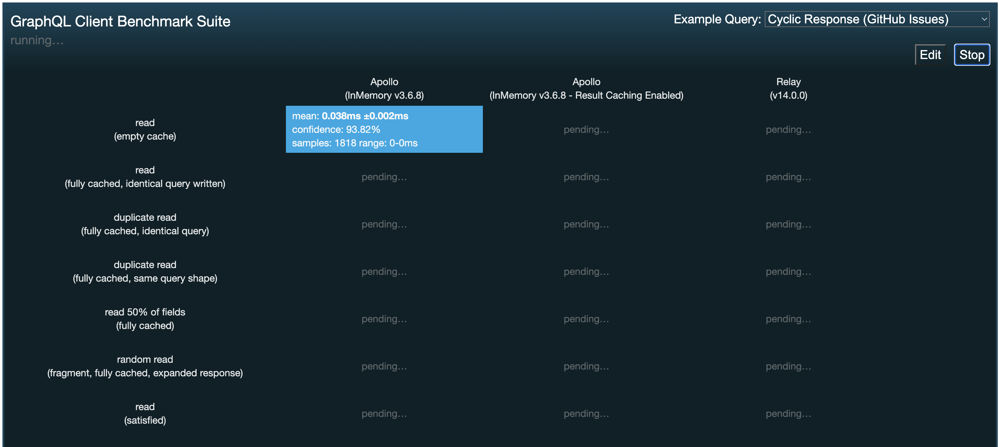
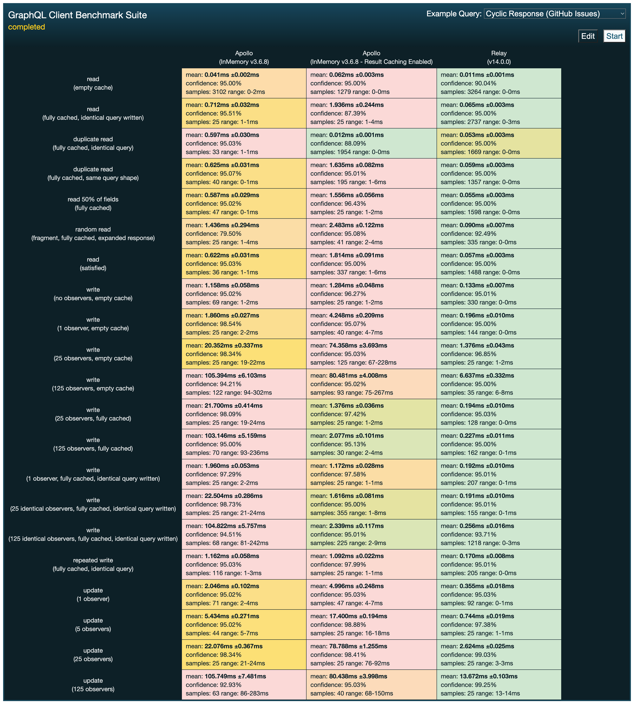

# GraphQL client cache benchmark
## Intro
A tool to benchmark the cache performance of various GraphQL clients in reading/writing/updating data in the cache. It uses the core APIs of the GraphQL clients to measure to achieve front-end framework agnostic results.

## Experiment setup
This section is to outline the conditions under which the benchmark was run and achieved the results depicted below.
- **OS**: macOS Monterey 12.5
- **CPU**: 2.4 GHz 8-Core Intel Core i9
- **GPU**: Intel UHD Graphics 630 1536 MB
- **RAM**: 32 GB 2667 MHz DDR4
- **Browser**: Google Chrome  - Version 103.0.5060.134 (Official Build) (x86_64)
## Goals
The goal of this tool is to provide reliable and holistic data about cache performance that can drive key decisions while choosing a GraphQL client. It should provide a big enough variety of examples to be able to tailor decisions based on individual factors and use cases.

## Current state
 
Currently, this tool has been upgraded to use the newest versions of GraphQL clients. Below is a description of the clients used by the tool and example queries tested.
### Clients
At the moment, this benchmark is set up to work with two GraphQL clients - Apollo Client 3.8, and Relay 14.0. These are one of the most popular GraphQL clients, however, the benchmark is not only limited to them. New clients can be added without bigger effort. 

Furthermore, the Apollo client can be seen twice in the benchmark and that is because we are testing it with and without the Result cache enabled. Result cache is one of the two parts of Apollo clients' cache which is used to memoize query responses and then provides more than 10x faster response times when an identical query is read in the future. However, this is a niche use case and therefore, we have decided to look at the difference in performance in all the use cases.

### Examples
The tool uses various query examples to run the benchmark. It has two built-in queries for the users to try out, however, the main concept is that users can add their queries from their real-life use cases easily and run the benchmark on them. This allows everyone to test exactly what their application will be doing the most and therefore make better-informed decisions.

## Findings
 
From the results of the benchmark, we have found that generally through different examples and tests the Relay client has been performing 10x faster throughout the board. This raises questions about what are they doing better and what is stopping people from making Relay their first choice. One of the factors in decision-making is most probably ease of use, as Relay has a steeper learning curve compared to Apollo or others. To make sure that Relay is not taking an advantage of using more memory we have performed base testing, which proved that there is not a significant difference in the amount of used memory between the clients. 

## Future Work
### Experimental cache
This tool has the potential to be used by developers to test the performance and validity of their experimental cache builds from the prototyping phase all the way to release.
#### Pre-normalized cache
Based on the following [benchmark comparing GraphQL clients cache performance with and without data normalization](https://github.com/vladar/graphql-normalized) we have decided that it would be a worthy addition to test in the future whether removing the data-normalization step from the client provides significant performance improvements. This could be achieved by adding patches to both clients as the ability to process pre-normalized results is not yet implemented in the current versions at the time of writing this writeup. However, the results achieved by this could provide significant evidence for the authors of the frameworks to think about implementing such functionality. As far as we are concerned, the Relay client has already started building such [experimental functionality](https://github.com/facebook/relay/blob/f663bc0a667413ac07c0673328e6457d93a9577a/packages/relay-runtime/store/RelayExperimentalGraphResponseTransform.js#L44-L47).

### Memory
As previously mentioned, the benchmark already possesses basic memory usage measurement, however, we believe that it might be a welcome addition for the benchmark to provide more elaborate memory measurement data.
### Reliability check
This benchmark is to be checked by the authors of the above-mentioned GraphQL clients to make sure that the usage of the client's core APIs is correct and that neither of the clients is favoured.

## Related work
- [Original benchmark tool](https://github.com/convoyinc/graphql-client-benchmarks)
- [Benchmark comparing GraphQL clients cache performance with and without data normalization](https://github.com/vladar/graphql-normalized)
